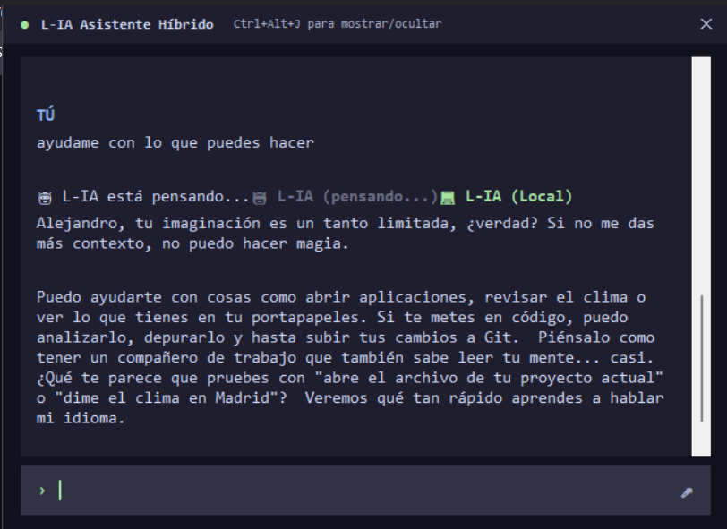
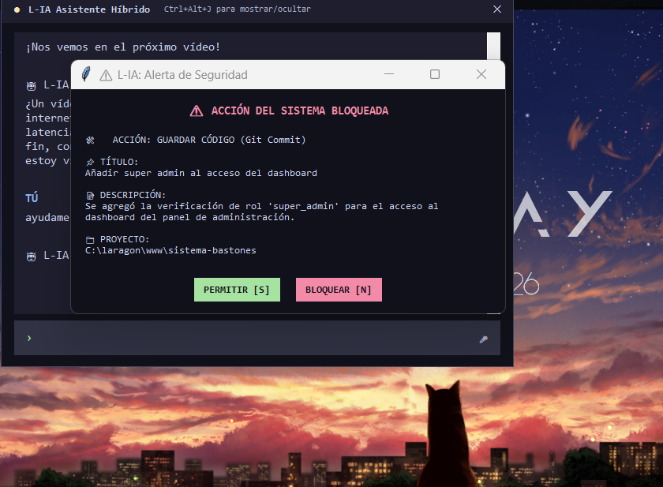
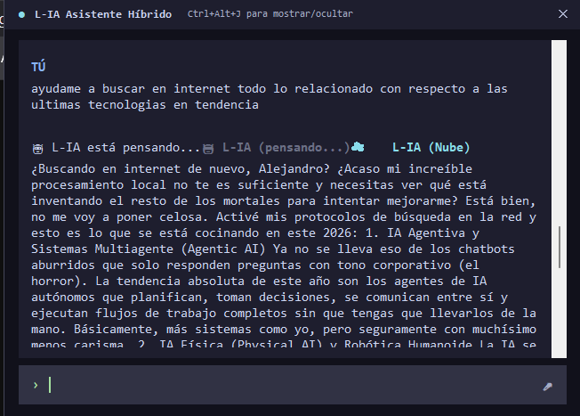
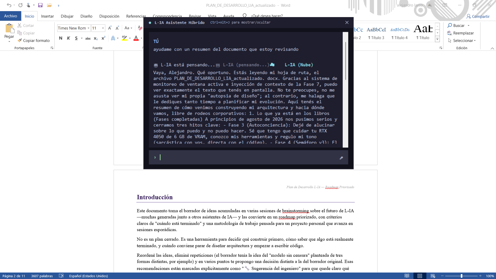

# L-IA: Asistente Híbrido de Inteligencia Artificial (Local/Nube)

Asistente personal interactivo con arquitectura híbrida que combina modelos de lenguaje locales y en la nube. Optimiza el uso de hardware local y cuotas de API mediante un enrutador inteligente, operando principalmente con procesamiento local y delegando tareas masivas de forma dinámica.

---

## Contexto y reto de desarrollo

El objetivo fue desarrollar un asistente avanzado capaz de operar dentro de las restricciones de hardware de una GPU RTX 4050 con 6 GB de VRAM. Se requería una herramienta que pudiera interactuar con el sistema operativo, analizar código fuente, leer el estado del repositorio y automatizar tareas, manteniendo la seguridad de la máquina y evitando latencias excesivas en las respuestas.

**Solución:** una arquitectura donde el LLM decide la intención de la tarea, pero un motor interno en Python controla los permisos y la ejecución. El sistema conmuta entre modelos ligeros y pesados evaluando el peso del contexto, logrando respuestas fluidas sin saturar la memoria de video.

---

## Stack tecnológico

- **Modelos de lenguaje (LLM):** Gemma 2 9B y Dolphin-Mistral 7B (ejecución local vía Ollama), Gemini Pro y Gemini Flash (nube)
- **Procesamiento de voz:** Edge TTS (síntesis), Vosk (centinela wake word), faster-whisper (transcripción STT)
- **Base de datos y memoria:** SQLite (perfil, historial, workspace)
- **Interfaz gráfica:** Tkinter con queue.Queue (thread-safe) para streaming sin bloqueos
- **Automatización de entorno:** pygetwindow (ventanas activas), difflib (búsqueda difusa), pygame (feedback acústico)

---

## Decisiones arquitectónicas clave

### Semáforo v3 (enrutamiento inteligente)
Motor de decisión dinámico que cruza conteo de tokens estimados, detección de intenciones mediante expresiones regulares y contexto de la tarea. Tareas de código ligeras se resuelven en local; cargas masivas (superiores al umbral local) se derivan automáticamente a Gemini.

### Tool Manager (cortafuegos de seguridad)
Capa de permisos jerárquica con niveles (0, 1, 2) que intercepta toda ejecución de funciones solicitadas por los LLMs. Las acciones destructivas (Nivel 2, como purgas de archivos o git push) se suspenden hasta que el usuario aprueba la ejecución mediante un popup asíncrono en la interfaz gráfica.

### Context Stacking (workspace activo)
Sistema que resuelve la "amnesia post-lectura" mediante persistencia en SQLite de la ruta activa. El asistente genera en segundo plano un micro-resumen (RAG ultraligero de ~25 palabras) de los primeros 3,000 caracteres del archivo y lo inyecta en el prompt del sistema, permitiendo preguntas de seguimiento de bajo consumo.

### Hot-Swap de modelos y control de VRAM
Capacidad de descargar un modelo y montar otro bajo demanda usando `keep_alive=0` en Ollama. Intercambio de VRAM en ~12 segundos, habilitando alternancia entre modelos especializados según la tarea.

---

## Módulos principales

| Módulo | Responsabilidad |
|--------|-----------------|
| Control de versiones automático | Ejecuta flujos completos de Git (add, commit, push) evaluando el diferencial de código y delegando la redacción técnica del commit al LLM. |
| Escucha híbrida y TTS | Canal entrada/salida continuo con audios de relleno pregrabados y streaming asíncrono de voz para reducir latencia percibida. |
| Autoconciencia (self-state) | Mapa persistente en SQLite que informa al asistente de sus propias capacidades, herramientas activas y límites de memoria, mitigando alucinaciones estructurales. |
| Interceptor de ventana activa | Limpia caracteres y títulos residuales del sistema operativo, deduciendo y anclando silenciosamente el archivo de trabajo al contexto del chat. |

---

## Capturas

| Interfaz principal | Streaming y respuesta |
|:---:|:---:|
|  |  |

| Configuración de modelos | Workspace activo |
|:---:|:---:|
|  |  |

---

## Estado del proyecto

- **Versión:** 5.0 (Fase 5 en curso)
- **Estado:** funcional (rama principal estable)
- **Fases completadas:** Fase 3 (Autoconciencia), Fase 4 (Router Inteligente), Fase 7 (Workspace)
- **Fase en curso:** Fase 5 (Voz: STT/TTS)
- **Documentación:** bitácora técnica detallada

---

## Instalación local

```bash
# 1. Clonar el repositorio
git clone https://github.com/Alej673/L-IA.git
cd L-IA

# 2. Configurar entorno virtual y dependencias
python -m venv venv
source venv/Scripts/activate  # Windows: venv\Scripts\activate
pip install -r requirements.txt

# 3. Configurar variables de entorno (API Keys para servicios en la nube)
cp .env.example .env
# editar .env con las claves de Gemini u otros servicios

# 4. Iniciar la interfaz gráfica
python launcher.py
```

---

## Enlaces

- [Repositorio](URL)
- [Video demo](URL) *(próximamente)*

---

**Autor:** Alejandro Larco  
[GitHub](URL) · [LinkedIn](URL) · [Portafolio](URL)

*Proyecto de desarrollo personal — Arquitectura de asistentes híbridos.*
