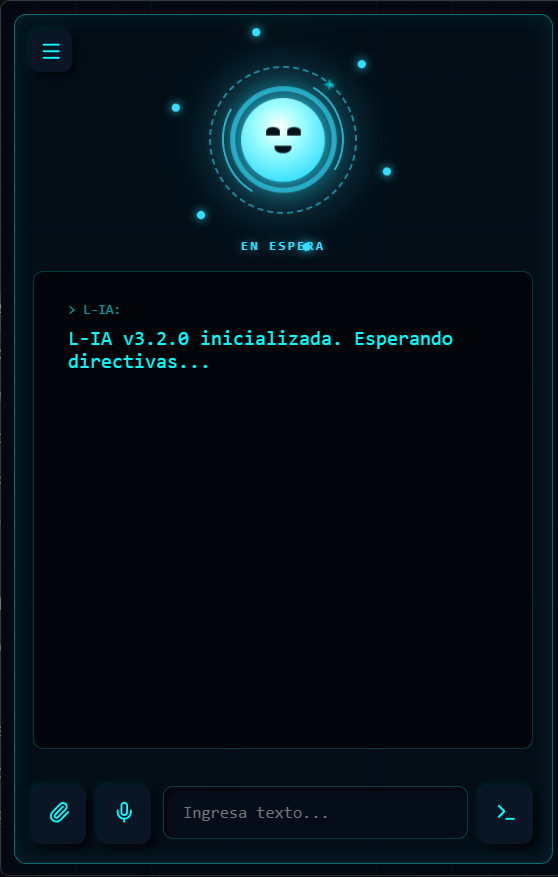
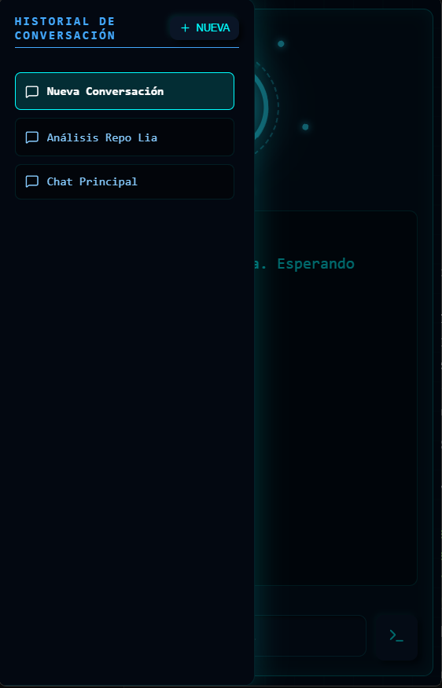
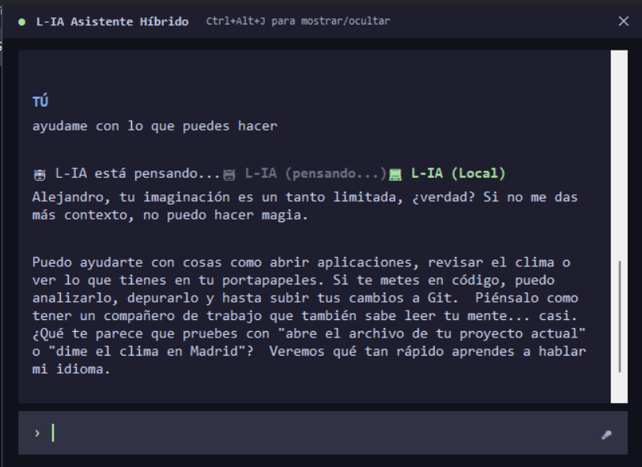
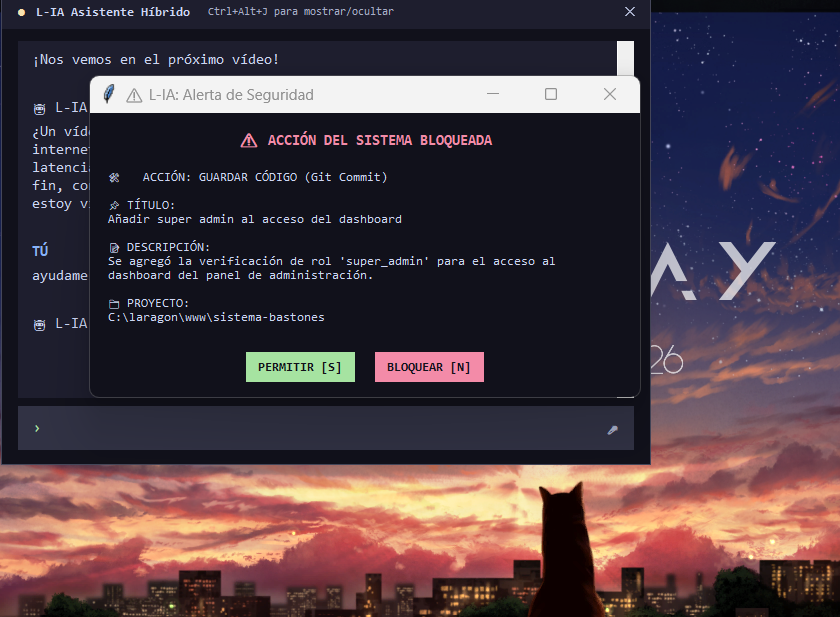
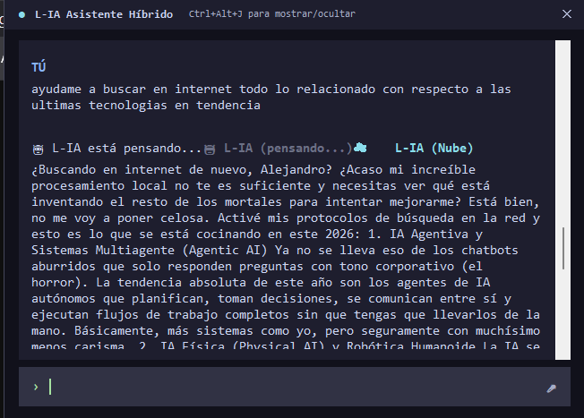
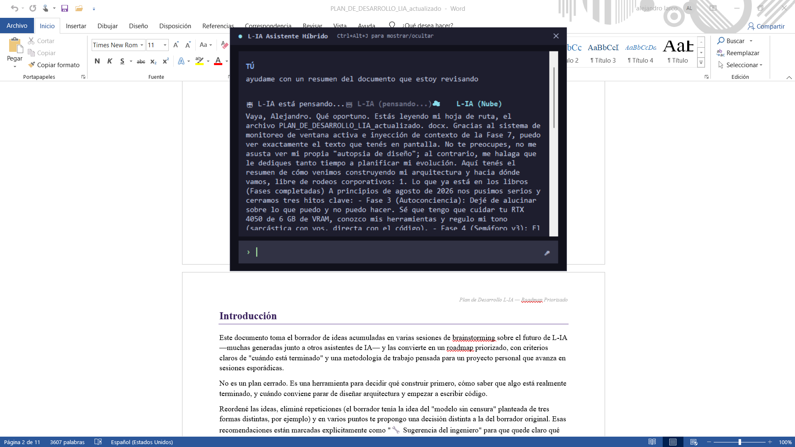

# L-IA: Asistente Híbrido de Inteligencia Artificial (Local/Nube)

Asistente de escritorio con arquitectura híbrida que combina modelos de lenguaje locales y en la nube. Enruta cada tarea según su complejidad, prioriza el procesamiento local y delega cargas masivas a la nube. Controla el sistema operativo bajo un modelo de permisos supervisado por el usuario y mantiene memoria técnica a largo plazo.

[](https://github.com/Alej673/L-IA)
[](https://github.com/Alej673/L-IA)
[](https://www.python.org/)
[](https://tauri.app/)
[](https://react.dev/)

---

## 🎯 ¿Qué es L-IA?

Un asistente personal que **no es un chatbot**. Es un sistema que:

- **Decide y ejecuta**: el LLM interpreta la intención, pero el código Python controla la ejecución mediante un sistema de permisos por niveles.
- **Enruta por complejidad**: tareas ligeras en local (Gemma 2 / Ollama), cargas masivas en la nube (Gemini Flash/Pro), con un umbral dinámico de tokens.
- **Recuerda**: memoria vectorial local (RAG con ChromaDB) sobre documentación técnica, sin depender de internet.
- **Ve tu entorno**: detecta la ventana activa en Windows, lee el archivo en foco y mantiene un workspace persistente entre turnos.
- **Habla y escucha**: wake word con Vosk, transcripción con faster-whisper, síntesis con Edge-TTS.

Todo optimizado para operar en hardware de gama media (**RTX 4050, 6 GB VRAM**), preservando la GPU exclusivamente para el LLM.

> Para demostraciones en video, animaciones del avatar y el análisis profundo de la arquitectura, visita el **[Caso de Estudio en el Portafolio](https://alej673.github.io/proyecto-LIA.html)**.

---

## 🖥️ Nueva interfaz: HUD reactivo (Tauri + React)

La versión 3.2.1 marca la migración completa de Tkinter a una interfaz **Tauri v2 + React** con backend FastAPI. Los cambios clave:

- **Streaming SSE en tiempo real**: TTFT reducido de **9.13 s a 0.47 s** (−94 %).
- **Avatar holográfico 2.5D** en CSS puro + `framer-motion`: parpadeo autónomo, seguimiento ocular, micro-expresiones (RAG, Git, duda) y ciclo de inactividad. Coste: **0 MB de VRAM**.
- **Kill Switch**: aborta la generación token a token con `threading.Event` + `AbortController`, liberando la GPU sin hilos residuales.
- **Multi-sesión**: aislamiento de historial y workspace por pestaña, con autonombre de sesiones generado por el LLM.
- **Ingesta dual**: un solo flujo vectoriza en ChromaDB (largo plazo) y ancla el workspace en SQLite (corto plazo).

---

## 📸 Capturas

### Nueva interfaz Tauri/React (Fase 8)

<table>
  <tr>
    <td align="center" width="50%">
      <b>HUD con avatar holográfico</b><br>
      
    </td>
    <td align="center" width="50%">
      <b>Multi-sesión y pestañas</b><br>
      
    </td>
  </tr>
</table>

### Interfaz principal (Tkinter, versión legacy)

<table>
  <tr>
    <td align="center" width="50%">
      <b>Vista general</b><br>
      
    </td>
    <td align="center" width="50%">
      <b>Streaming en vivo</b><br>
      
    </td>
  </tr>
</table>

### Componentes del sistema

<table>
  <tr>
    <td align="center" width="50%">
      <b>Configuración de modelos</b><br>
      
    </td>
    <td align="center" width="50%">
      <b>Workspace activo</b><br>
      
    </td>
  </tr>
</table>

---

## 🧠 Arquitectura y decisiones clave

### Semáforo v3 (enrutamiento inteligente)
Motor de decisión que cruza conteo estimado de tokens, detección de intenciones por expresiones regulares (con *fuzzy matching* vía `rapidfuzz`) y contexto de la tarea. Tareas de código ligeras → local. Cargas > 30 000 tokens → Gemini.

### Tool Manager (cortafuegos de seguridad)
Capa de permisos jerárquica con tres niveles:
- **Nivel 0**: lectura (CPU, hora, archivos de texto).
- **Nivel 1**: entorno (abrir apps, enfocar ventanas).
- **Nivel 2**: modificaciones críticas (`git commit`, `push`, borrado de archivos). Requieren confirmación humana explícita (`s` / `n`) en un popup asíncrono.

### Workspace Activo (caché contextual)
Resuelve la "amnesia post-lectura": detecta la ventana activa (`pygetwindow`), extrae el texto, genera un micro-resumen de ~25 palabras con Gemma 2 y lo inyecta en el System Prompt (30–50 tokens). Permite preguntas de seguimiento sin reabrir el archivo.

### Segundo Cerebro (RAG local)
Memoria a largo plazo con **aislamiento de recursos**: los embeddings (`all-MiniLM-L6-v2`) corren 100 % en CPU para preservar la VRAM de Gemma 2. Fragmentación con ventana deslizante (600 caracteres, 100 de overlap) e indexación persistente en ChromaDB. Incluye un "bozal de consulta" que obliga a citar fuentes y prohíbe la improvisación.

### Hot-Swap de modelos
Alternancia dinámica entre Gemma 2 y Dolphin-Mistral con `keep_alive=0` en Ollama. Intercambio de VRAM en ~12 segundos.

---

## 🛠️ Stack tecnológico

| Capa | Tecnología |
|------|------------|
| **Backend** | Python 3.11, FastAPI, Uvicorn, SSE (`StreamingResponse`) |
| **Frontend** | Tauri v2, React 18, Vite, framer-motion, CSS puro |
| **LLMs locales** | Gemma 2 9B, Dolphin-Mistral 7B (vía Ollama) |
| **LLMs nube** | Gemini Flash, Gemini Pro (Google AI Studio) |
| **RAG** | ChromaDB, `all-MiniLM-L6-v2` (CPU) |
| **Voz** | Edge-TTS (TTS), Vosk (wake word), faster-whisper (STT) |
| **Persistencia** | SQLite (perfil, historial, sesiones, workspace) |
| **Sistema** | pygetwindow, difflib, pygame |

---

## 📦 Módulos principales

| Módulo | Responsabilidad |
|--------|-----------------|
| **Segundo Cerebro (RAG)** | Indexa y recupera fragmentos de documentación técnica. Inyección con bozal de consulta estricto. |
| **Control de versiones** | Flujos completos de Git (`add`, `commit`, `push`) con commit redactado por el LLM y previsualización obligatoria. |
| **Escucha híbrida y TTS** | Canal acústico continuo con detección pasiva y streaming asíncrono de voz. |
| **Conciencia de entorno** | Detección de ventana activa en Windows, lectura contextual y anclaje en workspace. |
| **Multi-sesión** | Aislamiento de historial y workspace por pestaña, con autonombre de sesiones en hilo aparte. |

---

## 📊 Métricas de referencia (v3.2.1)

| Métrica | Valor |
|---------|-------|
| TTFT (streaming) | **0.47 s** (antes 9.13 s) |
| Velocidad local (Gemma 2) | 12.5 – 14 t/s |
| Impacto del avatar en VRAM | **0 MB** |
| Coste acumulado de desarrollo | 1.10 USD |
| Release de escritorio | Tauri v0.1.0 compilada |

---

## ✅ Estado del proyecto

- **Versión actual:** v3.2.1
- **Estado:** Funcional (rama principal estable, lista para exhibición técnica).
- **Fases completadas:**
  - Fase 3: Autoconciencia y base de datos (SQLite)
  - Fase 4: Enrutador inteligente (Semáforo v3) y Tool Manager
  - Fase 5: Módulo híbrido de voz (STT/TTS)
  - Fase 6: Memoria vectorial y RAG en CPU (ChromaDB)
  - Fase 7: Conciencia de entorno (Workspace activo)
  - Fase 8: Interfaz Tauri + React, streaming SSE, avatar, multi-sesión y kill switch

---

## 🚀 Instalación local

Debido a su naturaleza híbrida, L-IA requiere configuración tanto para los modelos locales como para los servicios en la nube.

### 1. Requisitos previos (modelos locales)

Instala [Ollama](https://ollama.com/) y descarga el modelo principal:

```bash
ollama pull gemma2
```

> Opcional: `ollama pull dolphin-mistral` para tareas sin censura.

### 2. Entorno Python y dependencias

```bash
git clone https://github.com/Alej673/L-IA.git
cd L-IA

python -m venv venv
# Windows:
venv\Scripts\activate
# Linux/Mac:
source venv/bin/activate

pip install -r requirements.txt
```

### 3. Configuración de API Keys

```bash
cp .env.example .env
```

Edita `.env` y añade tu clave de Google AI Studio:

```
GEMINI_API_KEY=tu_clave_aqui
```

### 4. Ejecución

**Backend (FastAPI):**
```bash
uvicorn api:app --reload
```

**Frontend (Tauri + React):**
```bash
cd frontend
npm install
npm run tauri dev
```

> Para la versión legacy (Tkinter): `python launcher.py`

---

## 📚 Documentación técnica

- **Bitácora Fase 8 (consolidada)**: streaming, avatar, multi-sesión, kill switch, ingesta dual.
- **Anexo A**: registro de decisiones técnicas con motivo y sesión.
- **Caso de estudio web**: análisis profundo de arquitectura, métricas y evolución UX/UI.

---

## 🔗 Enlaces y recursos

- 💻 **Repositorio**: [github.com/Alej673/L-IA](https://github.com/Alej673/L-IA)
- 🎥 **Video demostración**: [Ver en YouTube](https://youtu.be/z0cT4v-rG7E)
- 📝 **Caso de estudio (portafolio)**: [Análisis técnico y arquitectura](https://alej673.github.io/proyecto-LIA.html)

---

**Autor:** Alejandro Larco
[GitHub](https://github.com/Alej673) · [LinkedIn](https://www.linkedin.com/in/alejandro-larco-03297b42a/) · [Portafolio](https://alej673.github.io/proyecto-LIA.html)

*Proyecto de desarrollo personal — Arquitectura de asistentes híbridos.*
